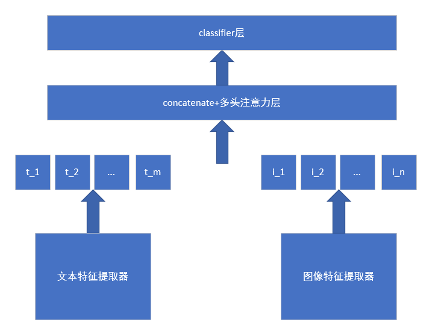

# MultiModal Sentiment Analysis

This is the repository for course *Comtemporary Artifical Intelligence2023* lab5: construct a multimodal (texts and images)  sentiment analysis

## Setup

pip install -r requirements.txt

```txt
matplotlib==3.7.1
numpy==1.24.3
pandas==2.0.1
Pillow==9.4.0
Pillow==10.0.0
scikit_learn==1.3.0
torch==1.13.1
torchvision==0.14.1
tqdm==4.65.0
transformers==4.29.1
```


## Repository Structure

│  config.json #load all the parameters
│  data_utils.py #process raw data to json files
│  main.py 
│  multiClassification.py #conbine text and image features for sentiment analysis
│  multiModalDataset.py #load data for multiClassifier
│  README.md
│  requirements.txt
│
├─baseline_model
│  │  data_pipelines.py #load data for imgClassification and textClassification
│  │  imgClassification.py #sentiment analysis using only image features
│  │  runUtils.py #functions for train validate and predict
│  │  textClassification.py #sentiment analysis using only text features
│
├─data
└─model_structure
        model.png

## Model Structure




## How to run

First of all, download the data from the [link](https://drive.google.com/drive/folders/1GVmcOQvM2UjBGSfF6q9tS_6fAZctoX_Y?usp=sharing) here or you can use your own data, put it in the data folder


**tran and validate the program**

`python main.py --train --test --mode [mode]`

**use the program to predict**

`python main.py --predict --mode[mode]`

**optional parameters and its meanings:**

- --mode: img_only / text_only / img_and_text, default: img_and_text
- --text_model
- --train_data_json: path to store the train data (json file)
- --test_data_json: path to store the predict data (json file)
- --batch_size: The batch size of all the datasets, default: 32
- --epoch: Training iteration number
- --saved_img_model_path: path to save the image_only mode model
- --saved_text_model_path: path to save the text_only mode model
- --saved_model_path: path to save the multi modal model
- --img_lr: learning rate for img_only mode
- --text_lr: learning rate for text_only mode
- --efnet_lr: learning rate for EFNet
- --xlmroberta_lr: learning rate for xlmRoBERTa


## References

1. Multi-Attention Multimodal Sentiment Analysis https://dl.acm.org/doi/abs/10.1145/3372278.3390698
2. Multimodal Sentiment Analysis Representations Learning via Contrastive Learning with Condense Attention Fusion https://www.mdpi.com/1424-8220/23/5/2679
3. Multimodal sentiment analysis based on multi-head attention mechanism https://www.researchgate.net/publication/339777957_Multimodal_sentiment_analysis_based_on_multi-head_attention_mechanism
4. VistaNet: Visual Aspect Attention Network for Multimodal Sentiment Analysis https://ojs.aaai.org/index.php/AAAI/article/view/3799
